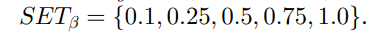

# 硕士论文工程

## 目标

- 在能耗约束下提升性能，降低成本

- 在考虑容错（可靠性）的约束下提升性能，降低成本

- 两者约束前提下提升性能降低成本（未实现）

# 总体思路

1. 将任务通过K-Means分类后为任务排序

2. 遍历任务队列，对当前任务计算当前任务的能耗约束

3. 遍历每个节点获得Node

4. 判断Node类型与Task是否一致，一致继续

5. 计算任务在当前节点执行的能耗大小并添加进队列中

6. 遍历整个符合能耗约束的节点，选择EFT最小（调度长度）的，即执行时间最小的（降低成本）

7. 完成所有任务后计算SL(G)与全局能耗以及成本作为实验依据

# 模型（随机生成模型）

## 任务排序

- 分类后的任务排序

- 其中任务在所有节点的平均执行时间

- 任务在单节点上的执行时间为

## 能耗

- 子任务能耗约束=总能耗约束-前者消耗能耗-后者预分配能耗值

- 其中前者的能耗

- 后者的能耗值为预分配最小的能耗,即以最低频率选择能耗最小的节点上执行的能耗值

## 调度长度

- 任务调度长度为SL(G)=minEFT(nexit)

- 实际上AFT

## 全局任务能耗

- 计算最终的真是能耗结果

## 可靠性

- 子任务可靠性约束

- 其中预分配的可靠性为

## 成本

- 成本模型

